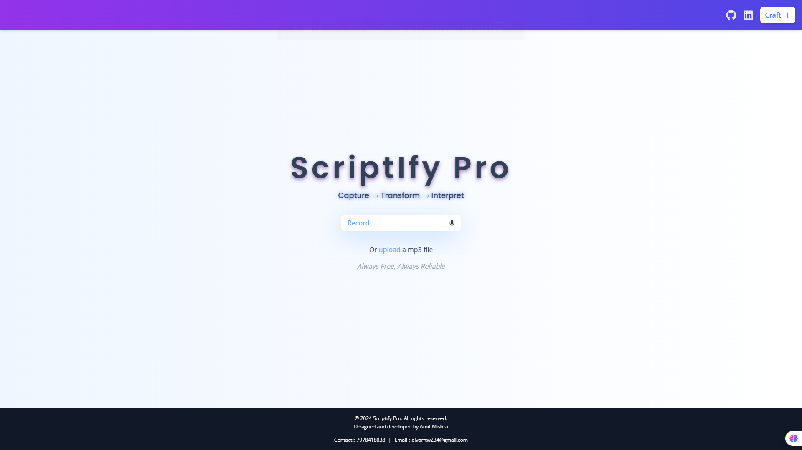
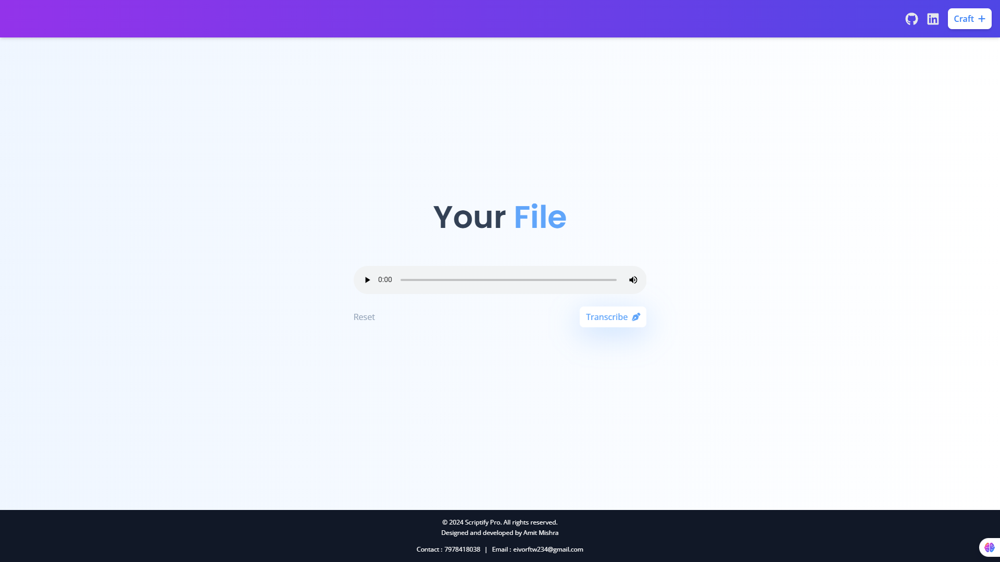
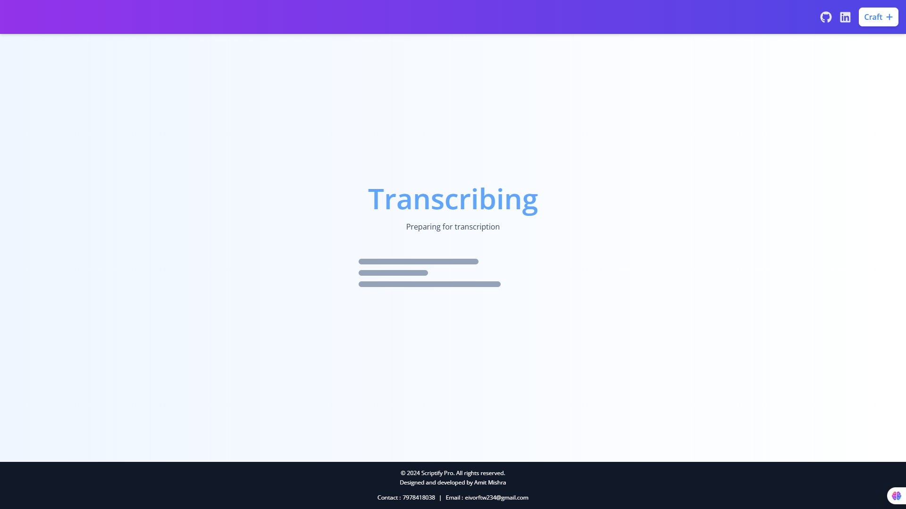
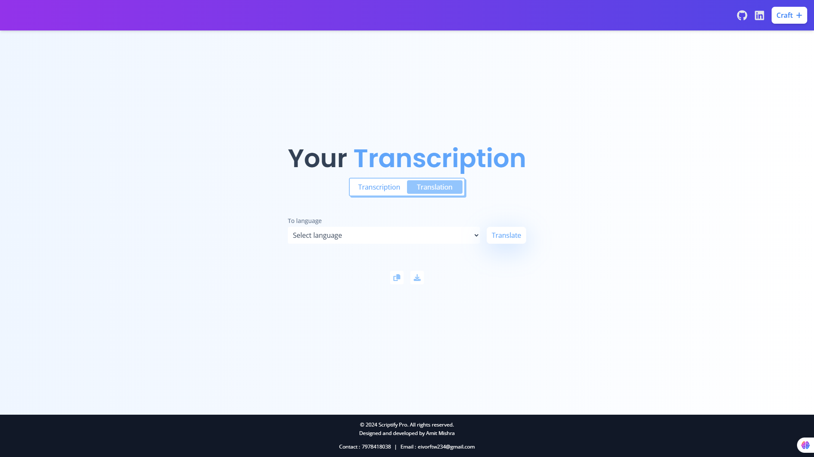

# Scriptify Pro

**Scriptify Pro** elevates transcription and translation with browser-based machine learning, delivering precise results swiftly and securely for both personal and professional users. 

---

## 🚀 Features

- **Advanced Transcription**: Seamlessly transcribe audio files to text with high accuracy.
- **Fast & Secure Translation**: Leverage machine learning for quick and secure translation between various languages.
- **Browser-Based**: Run directly in the browser with no installations required.
- **Real-Time Processing**: Instant feedback and results through Web Workers.
- **Smooth Animations**: Enhanced UI/UX using **Framer Motion** to animate interactions.

---

## 🖼️ Screenshots

### 1


### 2


### 3


### 4


---

## 🛠️ Tech Stack

- **Frontend**: React.js, Framer Motion
- **Web Workers**: For background processing and fast computations
- **Machine Learning**: Browser-based ML for transcription and translation
- **UI/UX**: Enhanced user experience with smooth animations using Framer Motion

---

## 🌐 Live Demo

Check out the live demo here: [Scriptify Pro Demo](https://your-demo-link.com)

---

## 📄 Installation and Setup

### Prerequisites
Ensure you have the following installed:
- [Node.js](https://nodejs.org/)
- [npm](https://www.npmjs.com/) or [yarn](https://yarnpkg.com/)

### Steps

1. **Clone the repository**:
   ```bash
   git clone https://github.com/yourusername/scriptify-pro.git
